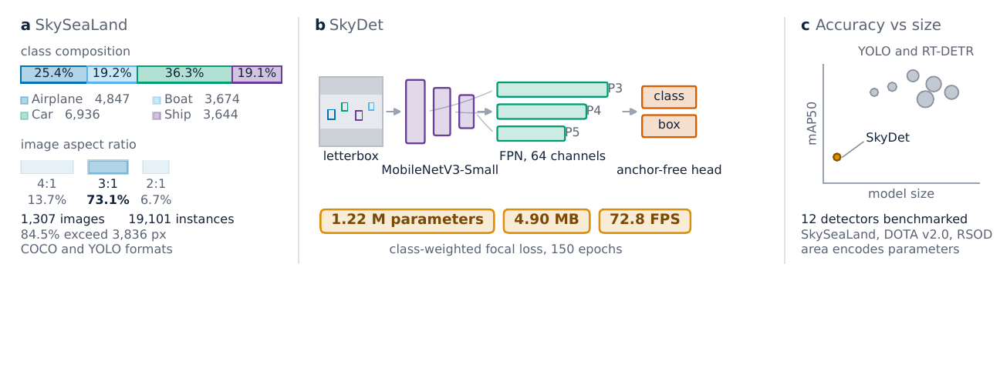

# SkyDet

### An ultra-lightweight satellite transportation detector and the reference baseline for SkySeaLand

[](https://arxiv.org/abs/2608.07382)
[](https://doi.org/10.17632/d42n3cp86p.3)
[](https://www.kaggle.com/datasets/mdzahidhasanriad/skysealand-coco)
[](LICENSE)
[](https://github.com/zahidhasanriad1/SkyDet/actions/workflows/quality.yml)

SkyDet is a **1.22 M-parameter, anchor-free detector** designed to establish the low-footprint end of the SkySeaLand benchmark. SkySeaLand contains **1,307 high-resolution satellite images** and **19,101 verified bounding boxes** spanning airplane, boat, car, and ship classes across land and maritime scenes.

<p align="center">
  
</p>

> SkyDet is presented as a documented low-footprint reference, not as a state-of-the-art accuracy claim. The benchmark is intended to make accuracy, model size, and hardware-qualified latency visible together.

## Highlights

- **Wide-format satellite imagery:** 84.5% of source images exceed 3,836 px on the longest side and 73.1% are close to a 3:1 aspect ratio.
- **Mixed transportation label space:** airplane, boat, car, and ship in a single terrestrial-maritime benchmark.
- **Dual annotations:** native COCO JSON and YOLO text labels.
- **Broad baseline study:** twelve detectors from the YOLO, RT-DETR, DETR, and Faster R-CNN families.
- **Deployment-oriented baseline:** 1.22 M parameters, a 4.90 MB checkpoint, and 72.8 FPS on a Tesla T4.

## SkyDet at a glance

| Component | Configuration |
|---|---|
| Backbone | MobileNetV3-Small, ImageNet pretrained |
| Feature fusion | 64-channel feature pyramid |
| Detection head | Anchor-free, depthwise separable |
| Objective | Class-weighted focal loss with box regression |
| Input policy | 640 x 640 letterbox resize |
| Training schedule | 150 epochs, cosine learning-rate decay |
| Parameters | 1.22 M |
| Checkpoint size | 4.90 MB |

## Reported test results

The following numbers are from Table IV of the manuscript. Latency is hardware-specific and should only be compared between runs measured under compatible conditions.

| Model | mAP50 | mAP50-95 | Parameters | Checkpoint | Latency | GPU |
|---|---:|---:|---:|---:|---:|---|
| RT-DETR-x | 87.32% | 60.36% | 65.48 M | 131.2 MB | 65.70 ms | Tesla T4 |
| YOLOv11m | 87.20% | 59.00% | 20.03 M | 40.5 MB | 7.30 ms | Tesla T4 |
| YOLOv10m | 84.40% | 56.40% | 15.32 M | 33.5 MB | 8.30 ms | Tesla T4 |
| **SkyDet** | **60.50%** | **24.32%** | **1.22 M** | **4.90 MB** | **13.74 ms** | **Tesla T4** |

See the [paper](paper/SkySeaLand_SkyDet_arXiv_2608.07382v1.pdf) for the complete twelve-model benchmark, evaluation protocol, cross-dataset diagnostics, and limitations.

## Dataset

| Split | Images | Annotations | Airplane | Boat | Car | Ship |
|---|---:|---:|---:|---:|---:|---:|
| Train | 1,048 | 15,034 | 3,927 | 2,683 | 5,459 | 2,965 |
| Validation | 132 | 1,992 | 367 | 657 | 679 | 289 |
| Test | 127 | 2,075 | 553 | 334 | 798 | 390 |
| **Total** | **1,307** | **19,101** | **4,847** | **3,674** | **6,936** | **3,644** |

Download the fixed release from [Mendeley Data](https://doi.org/10.17632/d42n3cp86p.3) or [Kaggle](https://www.kaggle.com/datasets/mdzahidhasanriad/skysealand-coco). Dataset details, directory conventions, and licensing notes are documented in [docs/DATASET.md](docs/DATASET.md).

## Quick start

```bash
git clone https://github.com/zahidhasanriad1/SkyDet.git
cd SkyDet

python -m venv .venv
# Linux/macOS: source .venv/bin/activate
# Windows: .venv\Scripts\activate

python -m pip install --upgrade pip
python -m pip install -r requirements.txt
jupyter lab notebooks/skydet-skysealand.ipynb
```

The reference notebook is Kaggle-ready. After attaching the Kaggle dataset, its default data root is:

```text
/kaggle/input/datasets/mdzahidhasanriad/skysealand-coco
```

For another environment, update `CFG.data_root` before running the pipeline.

Expected dataset layout:

```text
skysealand-coco/
├── train/
│   └── _annotations.coco.json
├── valid/
│   └── _annotations.coco.json
└── test/
    └── _annotations.coco.json
```

## Repository layout

```text
.
├── .github/                 # CI and collaboration templates
├── docs/
│   ├── assets/              # Publication-quality figures
│   ├── DATASET.md           # Dataset card
│   ├── MODEL_CARD.md        # Model card and limitations
│   └── REPRODUCIBILITY.md   # Run provenance and validation notes
├── notebooks/
│   └── skydet-skysealand.ipynb
├── paper/
│   └── SkySeaLand_SkyDet_arXiv_2608.07382v1.pdf
├── scripts/
│   ├── prepare_notebook.py
│   └── validate_notebook.py
├── CITATION.cff
├── LICENSE
└── requirements.txt
```

## Reproducibility status

The checked-in notebook preserves a **100-epoch development experiment** and its implementation details. The manuscript reports the finalized **150-epoch reference run** and best checkpoint at epoch 124. These are distinct recorded experiments; the notebook's embedded metrics must not be presented as an exact reproduction of Table IV. Full provenance and the current release boundary are documented in [docs/REPRODUCIBILITY.md](docs/REPRODUCIBILITY.md).

## Citation

If SkySeaLand or SkyDet supports your work, please cite the manuscript:

```bibtex
@article{riad2026skysealand,
  title   = {SkySeaLand: A Wide-Format Satellite Transportation Benchmark with an Ultra-Lightweight Detection Baseline},
  author  = {Riad, Md. Zahid Hasan and Ovi, Md Sultanul Islam},
  journal = {arXiv preprint arXiv:2608.07382},
  year    = {2026},
  url     = {https://arxiv.org/abs/2608.07382}
}
```

GitHub's **Cite this repository** action is also enabled through [CITATION.cff](CITATION.cff).

## Responsible use and limitations

SkySeaLand is a compact research benchmark. The current split is image-level rather than geographically separated; results are single runs under model-specific training budgets; most latency values were measured on different hardware; and no current-checkpoint per-class or per-scale AP is reported. See the [model card](docs/MODEL_CARD.md) before drawing deployment or comparative claims.

## Licenses

- Repository code is released under the [MIT License](LICENSE).
- SkySeaLand dataset files are released under **CC BY 4.0** through the official dataset hosts.
- The manuscript and source imagery are subject to their own copyright and provider terms. Dataset users must comply with those terms.

## Authors

- **Md. Zahid Hasan Riad** - Green University of Bangladesh
- **Md Sultanul Islam Ovi** - George Mason University
